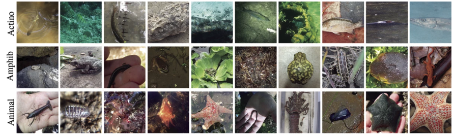

# Deep Neural Network Training for iNaturalist Image Classification | DA6401 Assignment 2 | Introduction to Deep Learning


This repository contains code for training and fine-tuning deep learning models on the iNaturalist dataset. It supports both training CNN models from scratch and fine-tuning pre-trained ResNet50 models.

WandB Project Report: [Report](https://api.wandb.ai/links/da24s011-indian-institute-of-technology-madras/ra12jfvd)
## Project Structure

Wrote a modular code for both Part A and Part B of the assignment.  Both follow the same pattern below:
```
.
├── main.py             # Main script for training models
├── model.py            # Model architecture definitions (CNN and ResNet50FineTuner)
├── dataset.py          # Data loading and augmentation utilities
├── trainer.py          # PyTorch Lightning training implementation
├── test.py             # Evaluation script for trained models
├── sweep_config.py     # Configuration for hyperparameter sweeps
└── requirements.txt    # Python dependencies
```


### Installation

1. Clone this repository:
   ```
   git clone https://github.com/utkarsh2299/da6401_assignment2.git
   cd da6401_assignment2
   ```

2. Install dependencies:
   ```
   pip install -r requirements.txt
   ```

3. Prepare the iNaturalist dataset:
   - Download the dataset
   - Organize it in the following structure:
     ```
     dataset/
     ├── train/
     │   ├── class1/
     │   ├── class2/
     │   └── ...
     └── test/
         ├── class1/
         ├── class2/
         └── ...
     ```

## Training Models

### Part A: Training a CNN from Scratch

```bash
cd Part_A
python main.py \
  --data_dir path/to/dataset \
  --model_type cnn \
  --batch_size 64 \
  --learning_rate 1e-3 \
  --max_epochs 30 \
  --num_blocks 5 \
  --base_filters 128 \
  --filter_config fixed \
  --filter_sizes 3 3 5 5 7 \
  --activation mish \
  --dense_neurons 512 \
  --use_augmentation
```

### Part B: Fine-tuning a Pre-trained ResNet50

```bash
cd Part_B
python main.py \
  --data_dir path/to/dataset \
  --model_type resnet50 \
  --batch_size 32 \
  --learning_rate 1e-4 \
  --max_epochs 20 \
  --dense_neurons 512 \
  --freeze_option 1 \
  --dropout_rate 0.2 \
  --use_augmentation
```

### Fine-tuning Strategies

The `--freeze_option` parameter controls which parts of the ResNet50 model are fine-tuned:

- **0**: Fine-tune only the fully connected (FC) layer
- **1**: Fine-tune FC layer + last convolutional block
- **2**: Fine-tune all layers (full fine-tuning)

## Hyperparameter Tuning

To run a hyperparameter sweep using Weights & Biases (default cnn):

```bash
python main.py \
  --data_dir path/to/dataset \
  --run_sweep \
  --sweep_count 60 \
  --project_name your_project_name
```

The sweep configuration is defined in `sweep_config.py` and can be modified to search different hyperparameter spaces. Here's the concise list:

| Argument | Type | Default | Description |
|----------|------|---------|-------------|
| `--data_dir` | `str` | **Required** | Path to dataset directory |
| `--batch_size` | `int` | `16` | Batch size for training |
| `--val_split` | `float` | `0.2` | Validation split ratio |
| `--use_augmentation` | `flag` | `False` | Enable data augmentation |
| `--image_size` | `int` (2 values) | `[224, 224]` | Input image size (H, W) |
| `--model_type` | `str` | `"cnn"` | `"cnn"` or `"resnet50"` |
| `--num_blocks` | `int` | `5` | No. of conv blocks (CNN) |
| `--base_filters` | `int` | `128` | Filters in first conv layer |
| `--filter_config` | `str` | `"fixed"` | `"fixed"`, `"doubling"`, `"halving"` |
| `--filter_sizes` | `int` list | `[3, 3, 5, 5, 7]` | Kernel sizes per conv layer |
| `--activation` | `str` | `"mish"` | Conv activation: `"relu"`, `"gelu"`, `"silu"`, `"mish"` |
| `--dense_activation` | `str` | `"relu"` | Dense layer activation |
| `--dense_neurons` | `int` | `512` | Neurons in dense layer |
| `--batch_norm` | `flag` | `False` | Use batch normalization |
| `--dropout_rate` | `float` | `0` | Dropout rate |
| `--freeze_option` | `int` | `1` | `0`: FC only, `1`: FC + last block, `2`: all layers |
| `--learning_rate` | `float` | `1e-3` | Learning rate |
| `--weight_decay` | `float` | `1e-5` | Weight decay |
| `--max_epochs` | `int` | `5` | Max training epochs |
| `--patience` | `int` | `10` | Early stopping patience |
| `--use_mixed_precision` | `flag` | `False` | Use mixed precision |
| `--project_name` | `str` | `"da6401_assignment2"` | W&B project name |
| `--run_name` | `str` | `None` | Optional W&B run name |
| `--checkpoint_dir` | `str` | `"./checkpoints"` | Save directory for checkpoints |
| `--run_sweep` | `flag` | `False` | Run hyperparameter sweep |
| `--sweep_count` | `int` | `60` | Sweep run count |

## Model Architectures

### CNN

The custom CNN architecture supports various configurations:

- Variable number of convolutional blocks
- Different filter configurations (fixed, doubling, halving)
- Custom filter sizes per layer
- Choice of activation functions
- Optional batch normalization

### ResNet50

The ResNet50 fine-tuning implementation:

- Uses pre-trained weights from ImageNet
- Allows different freezing strategies
- Replaces the final classification layer
- Supports customizable dense layer sizes and dropout

## Experiment Tracking

The project uses Weights & Biases for experiment tracking. Each run logs:

- Training/validation/test metrics
- Model architecture details
- Hyperparameters
- Example predictions and visualizations

## Results

Detailed comparisons between training from scratch and fine-tuning showed:

1. **Training Efficiency**: Fine-tuning converges significantly faster than training from scratch
2. **Performance with Limited Data**: Pre-trained models perform better with smaller datasets
3. **Feature Transferability**: Early convolutional layers learn domain-agnostic representations
4. **Hyperparameter Sensitivity**: Different fine-tuning strategies require different hyperparameter settings
5. **Resource Efficiency**: Fine-tuning requires fewer computational resources for comparable or better performance

## Note

Work done for the course Introduction to Deep Learning. Please raise an issue if the code doesn't work propely for any case.
